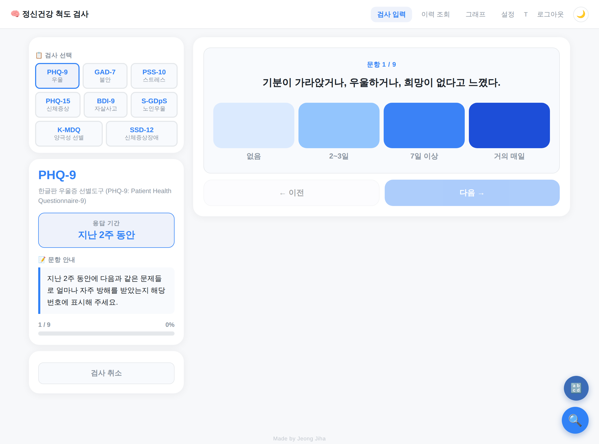
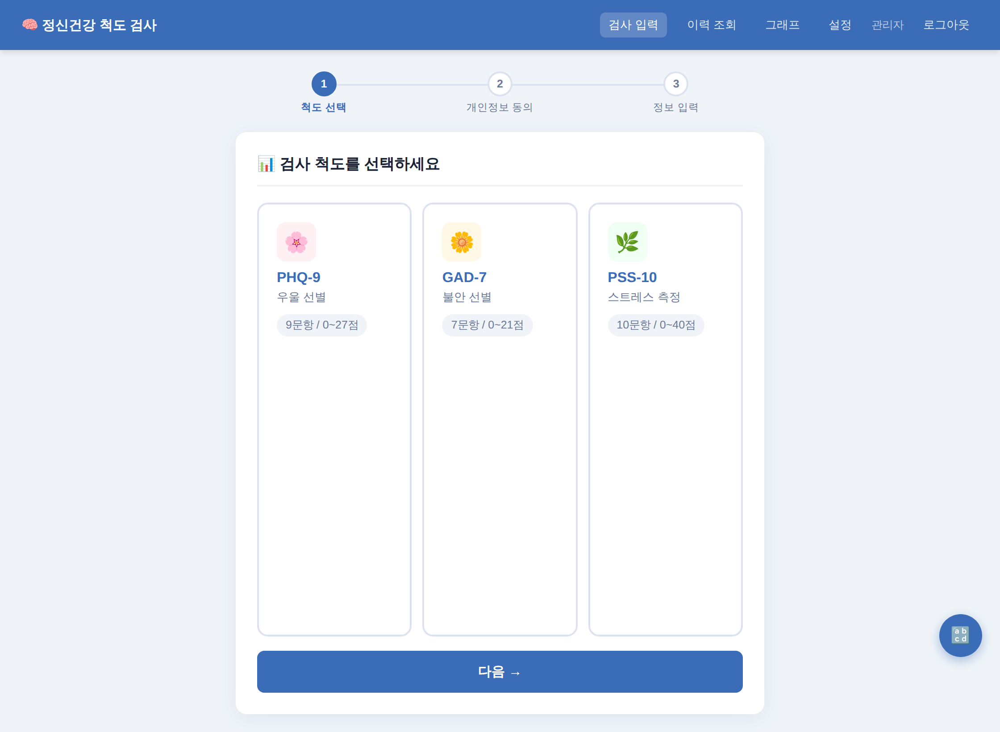
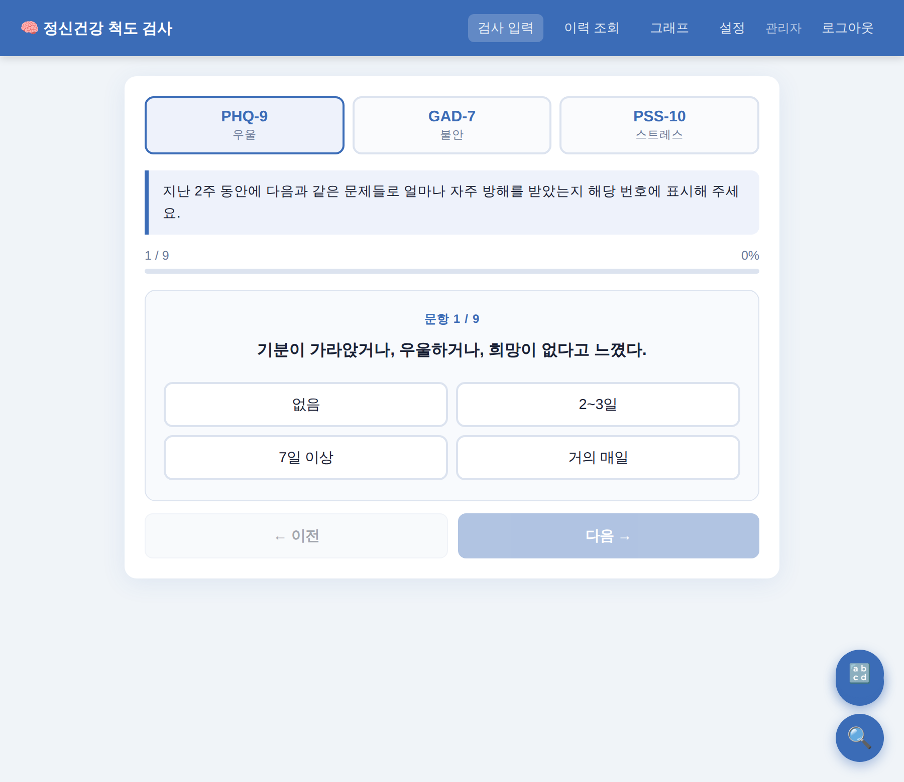
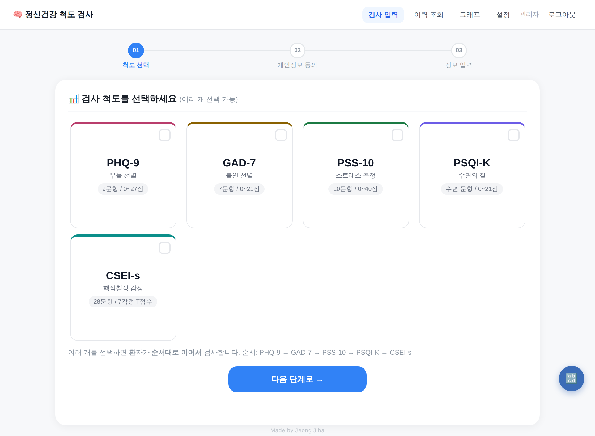
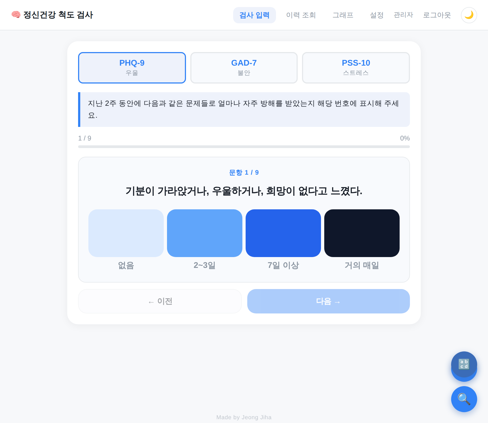

# 척도 앱(KHW3measures) 개발 일지

원광대학교 한방병원 한방신경정신과 심리검사 웹앱. 이 문서는 **날짜별**로 *요청(지시·질문) → 기획·계획 → AI 실수행 작업 → 사용 기술 → 앱의 실제 변화*를 기록합니다. 간호에서 "수행과 기록"에 해당하는 개발 인계 노트입니다.

읽는 법: 최신 날짜가 위. 각 날짜는 그날의 요청을 시간 순으로 정리하고, 그 결과 앱이 어떻게 바뀌었는지(Before → After)를 남깁니다.

> 📊 **UI 진화 타임라인(시각 요약)**: `docs/UI타임라인.html` 을 브라우저로 열면 3 → 5 → 10 척도로 자란 화면 변화를 각 시점의 **실제 캡처**로 한눈에 볼 수 있습니다. (Claude 아티팩트로도 게시됨)

---

## 2026-09-16 — GitHub 배포 체계, ISI 척도 추가, 환자 정보 수정

### 1) 요청
1. 프로젝트를 **GitHub에 푸시**하고, 다른 컴퓨터에 **한 번에 설치**되도록 해달라.
2. 매뉴얼(26.09.03)에 있는 **ISI(불면증 심각도 지수)** 척도가 앱에 누락되어 있으니 추가해달라.
3. **환자 기본정보(이름·생년월일·성별·연락처)를 수정**하는 기능을 만들어달라.

### 2) 기획·계획
- 원격 저장소(`jiha-hub/KHW3measures`)는 이미 연결되어 있어, **커밋 → 푸시**만 하면 됨. 자격증명은 사용자 PC(윈도우)에만 있어 푸시는 로컬에서 수행.
- "한 번에 설치"는 **새 XAMPP PC 기준**: 파일 배치 → DB 생성 → 스키마 적용 → config 생성을 배치파일 한 개로 자동화.
- ISI는 기존 척도 엔진(`scales.php`)에 자연스럽게 들어가는 세그먼트형 척도. 단, **문항마다 보기 문안이 다름**(만족도/방해/걱정 등) → 엔진에 문항별 보기(`question_options`) 지원을 추가.
- 환자 수정은 검사 기록(`assessments`)이 `patient_id`로 연결돼 있어 **환자 행만 UPDATE**하면 전 기록에 반영. 동명이인 안전장치 필요.

### 3) AI 실수행 작업
**GitHub·설치**
- `config.example.php`(설정 템플릿), **`install.bat`**(config 생성 + DB 생성 + `setup.sql` 적용 자동화), **`INSTALL.md`**(설치 안내) 추가.
- 이번 세션까지의 변경 전체를 커밋 후 원격 `main`에 푸시.

**ISI 척도**
- `scales.php`에 `'ISI'` 정의(7문항·0~28점). 매뉴얼 문안 반영. 문항별 보기는 `question_options`로 구현(값 0~4는 동일, 표시 문구만 문항별).
- `index.php` 문항 렌더에 `question_options` 지원(`$qOpts`) 추가.
- `consent.php`(검사 선택 카드)·`history.php`(이력 필터)·`patient_store.php`(정규 순서)·`graph.php`(절단선 15점)에 ISI 반영.
- DB: `setup.sql` ENUM에 `ISI` 추가, **`migration5_isi.sql`** + **`apply_migration5_isi.bat`**(원클릭 적용) 작성.
- 채점 경계값 검증: 7→없음, 8→역치하, 15→중등도, 22·28→심한 불면 (모두 정상).

**환자 정보 수정**
- **`patient_edit.php`** 신설: 이름·생년월일·성별·연락처 UPDATE. CSRF·로그인 검증, 날짜 유효성(`checkdate`), **(이름+생년월일) 중복 차단**.
- `history.php` 방문 헤더에 **`✏️ 정보수정`** 버튼 + 모달(생년월일 숫자 자동 하이픈) 추가. 방문 쿼리에 `patient_id`·`gender` 포함(그룹핑 반영).

### 4) 사용 기술
- 한글(.hwp) 매뉴얼에서 ISI 문항 추출: `olefile`로 HWP5 OLE 스트림을 열고 BodyText를 zlib 해제 → PARA_TEXT 레코드에서 UTF-16 텍스트 파싱(제어문자 스킵).
- PHP 문법 검사(`php -l`) 7개 파일 통과, ISI 채점 로직 단위 검증.
- Git: 원격은 공개 저장소라 읽기는 익명 가능하나 **푸시는 사용자 자격증명 필요** → 사용자 PC에서 푸시.

### 5) 앱의 실제 변화 (Before → After)
- 배포: 수동 복사 → **`install.bat` 원클릭 설치** + GitHub 최신화.
- 수면 척도: PSQI-K(수면의 질)만 → **ISI(불면증 심각도) 추가**로 불면 선별·추적 가능.
- 검사 엔진: 척도당 보기 1세트 → **문항별 보기 문안** 지원.
- 환자 정보: 최초 입력값 고정(수정 불가) → **이력 화면에서 언제든 수정**(전 기록 반영, 동명이인 보호).

---

## 2026-09-10 — 검사 순서·이력/그래프 개편, UI 세부 개선

### 1) 요청자(지하)의 지시

한 세션에서 9개 항목의 피드백:
0. 오늘 개발일지에 수정 내용을 상세히 추가.
1. CSEI-s 검사를 항상 맨 앞에 수행.
2. PHQ-15 4번 문항은 남자일 경우 바로 넘어가게 + 남자 채점 방법 설명·검증.
3. PSQI-K도 리커트식 세그먼트(색상) 응답 적용.
4. 결과의 검정 색상을 톤다운 그레이로.
5. 이력 조회: 검사 기간 설정, 사이드바 왼쪽, 생년월일 키패드 입력.
5-1. 이력을 검사일시(최상단)→환자명→척도순으로 명료하게 정리.
5-2. 이력 체크해서 한 번에 삭제.
6. 그래프: 환자 검색 참고 목록 잘림, 6-1 검사일별 환자 선택, 6-2 왼쪽 사이드바 스크롤 고정.
7. 7가지 감정 T점수 추이 그래프 확대/축소 + 기간 설정.
8. 이외 UI/UX 기술 관점 고려. 9. 항상 유니버설 디자인·반응형.

(참고: 앞으로 업데이트 완료 시마다 개발일지 기록 여부를 먼저 확인하기로 함.)

### 2) 기획·설계 결정

- CSEI-s "맨 앞": 전 앱의 정규 척도 순서(`scaleOrder()`)의 맨 앞으로 이동 → 연속검사 큐·이력 정렬·척도 선택 그리드에서 모두 CSEI-s가 선두. (선택했을 때 항상 먼저 수행되는 방식)
- 검정→그레이: 단일 색 토큰 `--severe`를 `#1a1a1a`→`#4b5563`(톤다운 슬레이트)로 전 파일 일괄 변경. 다크테마 값(#f9fafb)은 유지.
- 이력 그룹핑: "방문(검사일시)" 단위로 페이지네이션 후, 방문 안에서 척도순 정렬 → 검사일시 헤더 아래 환자·척도가 정렬돼 보이도록.
- 삭제: 기존 소프트삭제(숨김) 유지, `delete_assessment.php`를 `ids[]` 일괄 처리로 확장.
- 그래프 드롭다운 잘림: 사이드바의 `overflow:auto`가 절대위치 드롭다운을 잘랐던 것 → overflow 제거(내용이 짧아 불필요)로 해결 + sticky 유지.

### 3) AI 실수행 작업 (파일별)

- `patient_store.php`: `scaleOrder()` 맨 앞을 CSEI-s로.
- `scales.php`·`index.php`·`psqi.php`·`history.php`·`graph.php`·`summary.php`·`csei_survey.php`: `--severe`/severe 색상 `#1a1a1a`→`#4b5563`.
- `psqi.php`: 리커트 문항을 색상 세그먼트 바(seg-block) UI로 교체(+반응형/글자크게 대응).
- `history.php` 전면 개편: 왼쪽 고정 필터 사이드바, 검사 기간(from~to), 생년월일 숫자 키패드(자동 하이픈), 방문(검사일시)별 그룹 + 척도순 정렬, 행 체크박스 + 전체선택 + 일괄 삭제/복구 바.
- `delete_assessment.php`: 단일 `id` + 일괄 `ids[]` 모두 처리.
- `graph.php`: 사이드바 overflow 제거(드롭다운 잘림 해결)·sticky, "검사일로 찾기" 날짜 입력→그 날 검사한 환자만 필터, 7감정 추이 차트에 chartjs-plugin-zoom(휠·핀치 확대, 드래그 이동)+"확대 초기화" 버튼, 단일 척도 추이에도 동일 적용.

### 4) 사용 기술

Chart.js 4.4.1 + chartjs-plugin-zoom 2.0.1 + hammer.js 2.0.8(터치 핀치) · CSS position:sticky 2단 레이아웃 · SQL `COALESCE`/`GROUP BY`로 방문 단위 그룹핑 · PHP 8.4 · SQLite 셰임으로 렌더·SQL 검증(방문 그룹핑·CSEI-s 선두 정렬 확인), Playwright/Chromium UI 캡처.

### 5) 앱 변화 (Before → After)

- 연속검사 순서: 임의 → **CSEI-s가 항상 선두**.
- PSQI-K 응답 UI: 밋밋한 세로 버튼 → **색상 세그먼트 바**(다른 척도와 통일).
- 중한 결과 색: 검정(#1a1a1a) → **톤다운 그레이(#4b5563)**.
- 이력 조회: 상단 필터+평면 표 → **왼쪽 고정 필터(기간·생년월일 키패드) + 방문별 그룹(검사일시→환자→척도순) + 일괄 선택 삭제**.
- 그래프: 드롭다운 잘림/사이드바 → **잘림 해결·항상 고정, 검사일로 환자 찾기, 7감정 추이 확대/이동**.

### 6) 남성 PHQ-15 4번 문항 채점 (검증 결과)

문항 4(생리통)는 **여성 전용**. 남성 환자는 검사 화면에서 이 문항이 **표시되지 않고 자동으로 건너뜁니다**(응답 순서 배열에서 제외). 채점 시에는 이 문항을 **0점으로만 반영**하므로 남성 총점에 기여하지 않습니다. 검증: 남성이 나머지 14문항 만점이면 총점 28, 여성 15문항 만점이면 30 — 생리통 문항이 남성 점수에 더해지지 않음을 확인. 절단점(5/10/15) 밴드는 표준 관행대로 동일 적용.

### 7) 검증

전 PHP 파일 문법 검사 통과 · 척도 채점 회귀(PHQ-15/S-GDpS/K-MDQ/BDI-9/PSS-10 역채점) 통과 · SQLite로 이력 방문 그룹핑·CSEI-s 선두 정렬·일괄삭제 SQL 확인 · 이력/그래프 화면 렌더 캡처 확인. (그래프 차트는 CDN 스크립트라 로컬 캡처에선 빈 캔버스로 보이나 실제 브라우저에선 정상 렌더.)

### 8) 같은 날 후속 수정

**(a) 검사일 입력 = 숫자패드 + 달력 겸용**
- 지시: "모든 검사일 입력은 숫자패드와 달력 모두 가능하도록."
- 작업: 재사용 컴포넌트 `date_field.php` 신설(`renderDateField()`/`dateFieldAssets()`). 텍스트 입력(`inputmode=numeric`, 8자리→YYYY-MM-DD 자동 하이픈) + 오른쪽 📅 버튼(`showPicker()`로 네이티브 달력) 조합. 이력(검사 기간 시작/종료)·그래프(검사일로 찾기, 시작/종료) 총 5개 날짜 필드에 적용.
- 변화: 태블릿·모바일에서 숫자 키패드로 바로 입력하거나 달력으로 선택 — 어느 쪽이든 동일 값으로 검색.

**(b) 그래프 확대/이동 개선**
- 지시: 확대 후 좌우 드래그가 안 됨 / 7감정 추이는 조금만 확대해도 하루치만 보임.
- 원인: x축이 범주(category)축 → 칸 단위로 급확대되고 패닝이 뻑뻑.
- 작업: 두 추이 차트(7감정·단일 척도)의 x축을 **선형(linear)축**으로 전환(데이터 `{x:index,y}`, 눈금 콜백으로 날짜 라벨). 휠 확대 속도 0.06, `pan{mode:'x'}`로 좌우 드래그, `limits.minRange 1.5`로 최소 2~3개 지점 유지, 데이터 범위 밖 이동 방지.
- 변화: 부드러운 비례 확대 + 좌우 드래그 이동, 과확대 방지. (두 차트 JS를 node --check로 문법 검증.)

---

## 2026-09-04 — 신규 척도 5종 추가 + 검사 UI/기능 대개편

### 1) 요청자(지하)의 지시·기획·질문

이날 요청은 크게 세 묶음으로 들어왔습니다.

**(A) 신규 척도 추가 + 앱 피드백 6가지** (첨부: `SSD12_설문지.docx`, `한방신경정신과 심리검사 매뉴얼.hwp`)
- 두 첨부의 설문척도를 모두 앱에 추가.
- 피드백①: 피츠버그(PSQI) 문항을 앱과 대조해 파일에서 빠진 부분 추가. 결과 해석은 신뢰도 있는 근거 기반으로 검토.
- 피드백②: PSS-10과 피츠버그는 같은 응답이라도 문항별로 다른 점수를 부여하도록 설계됨 — 반영 여부 검토.
- 피드백③: 피츠버그에서 "수면 문제의 다른 이유"를 묻는 문항은 따로 주관식 입력이 되도록.
- 피드백④: 현재 진행 중인 검사 이름이 왼쪽에 보이도록. 문항박스 같은 탭을 만들어 "지난 2주 동안 ~ 응답해주세요" 같은 기본 안내 문구를 그곳으로 이동.
- 피드백⑤: 검사 중 취소하고 다음 검사로 넘어가는 버튼/기능.
- 피드백⑥: 검사 이력에서 기록 삭제 기능.
- 새로 추가할 척도: **PHQ-15, BDI-9, S-GDpS, K-MDQ** (+ 첨부 docx의 **SSD-12**).
- 모든 질문·응답은 터치식 스크린·반응형 UI·유니버설 디자인 고려.
- 사용자 피드백: 검사 결과에서 "중한 우울" 등 중한 결과가 붉은색으로 나타나면 불안감을 줄 수 있음 → 모든 중한 결과는 검정 바탕/글자로.
- 척도별 공통 안내(응답 기간: 지난 2주/지난 한 달 등)가 잘 안 보임 → 사이드바로 옮겨 가시성 강화.

**(B) 마이그레이션 실행 및 오류 대응**
- "migration4_newscales.sql 실행해줘" → 원격에서 DB 직접 접근이 막혀 있어, 브라우저로 1회 여는 `run_migration.php` 실행기 제작.
- `summary.php`에서 `Unknown column 'a.deleted_at'` 오류 발생 → 마이그레이션 미적용 확인 → 로그인 없이도 실행되고 컬럼 존재를 스스로 확인하는 견고한 버전으로 교체.
- "phpMyAdmin이 뭐야?", "마이그레이션의 역할과 뜻은?", "왜 삭제해야 하나?" 등 개념 질문 → 설명 후 `run_migration.php` 삭제.

**(C) 추가 피드백 3가지**
- ①: 여성만 해당하는 문항(PHQ-15 생리통)은 남성일 경우 점수 처리 검증 — 자동으로 넘기거나 계산되지 않도록.
- ②: 사이드바·문항/응답 이분할 구조와 응답 기간 표시를 **모든 척도**에서 동일한 UI로.
- ③: 피츠버그에서 **동거인이 있다고 응답한 경우에만** 관찰 문항(20~24번)을 응답하고 나머지는 넘기도록.

### 2) 기획·설계 결정 (착수 전 확인한 선택지)

작업 전 4가지를 확인받아 방향을 확정:
- 추가 척도 세트: **5개 모두**(SSD-12 포함).
- 이력 삭제 방식: **숨김(soft delete)** — 의료·연구 데이터라 완전삭제 대신 보존·복구 가능하게.
- 검사 중 취소 동작: **저장 없이 건너뛰기**.
- BDI-9 해석: 첨부의 'BDI 9'는 벡 우울척도의 **9번(자살사고) 단일문항(0~3)** → 단일문항 자살사고 선별로 구현.

아키텍처 방침: 기존 앱은 (a) 범용 리커트 엔진(`scales.php`+`index.php`)과 (b) 전용 모듈(PSQI, CSEI)로 나뉘어 있음. 새 5종은 응답 형식이 제각각(리커트 0–2/0–4, 예/아니오, 단일문항, 문항별 역채점)이라 **범용 엔진을 확장**해 한 화면에서 처리하도록 결정(모듈 5개 신설보다 코드·위험 최소화).

### 3) AI 실수행 작업

- 첨부 파일 판독: `.hwp`(한글, 압축 바이너리)를 `olefile`+zlib로 직접 파싱해 전 척도 문안 추출, `.docx`는 XML에서 텍스트 추출.
- `scales.php`: 신규 5종 정의 + `calculateScore()` 확장(문항별 점수맵 `item_scores`, 예/아니오, 하위영역 `subscales`, 여성전용 문항, 자살사고 플래그, 중한 결과 색상 헬퍼).
- DB: `migration4_newscales.sql`(ENUM 확장 + `deleted_at`) 및 `setup.sql` 갱신, `run_migration.php` 실행기.
- `index.php` 전면 개편: 좌측 사이드바(검사명·응답기간·문항안내·진행률·환자정보·취소버튼) + 우측 문항의 2단 레이아웃, 문항 유형별 렌더링(세그먼트/세로버튼/예·아니오), 여성전용 문항 남성 자동 스킵, 검사 취소 모달, 중한 결과 검정 표시.
- PSQI(`psqi.php`,`psqi_scoring.php`,`save_psqi.php`): 원 설문의 문항10(동거인 관찰) 참고문항 추가(채점 미포함), 5-j 주관식, 사이드바 2단 구조, **동거인 유무에 따른 20~24번 조건부 표시**, 중한 결과 검정.
- CSEI(`csei_survey.php`): 동일 사이드바 2단 구조 + 응답기간 + 검사 취소.
- 통합: `consent.php`(선택 그리드), `save_assessment.php`(하위영역 저장), `history.php`(삭제/복구·숨김보기·상세표시·색상), `graph.php`·`summary.php`·`emr_text.php`(신규 척도·절단선·색상).
- 소프트 삭제: `delete_assessment.php`(삭제/복구), 모든 목록·그래프·요약에서 숨김 기록 제외.
- 검증: PHP 8.4 문법 검사 전 파일 통과, SQLite로 저장→이력→삭제/복구→요약→그래프 엔드투엔드 테스트, 척도별 채점 단위검증(PSS 역채점, S-GDpS 문항별 방향, K-MDQ 개수, BDI-9 플래그, SSD-12 하위영역, PSQI 조건부 스킵 시뮬레이션).

### 4) 사용 기술

PHP 8.4 / MariaDB(XAMPP) · PDO · 세션·CSRF · 바닐라 JS(문항 슬라이드·자동저장 AJAX) · 반응형 CSS(사이드바 2단, 태블릿에서 상단 카드로 접힘) · Chart.js(그래프) · 근거 기반 채점 기준(Kroenke 2002, Sheikh&Yesavage GDS-15/SGDS-K, 전덕인 2009 K-MDQ, Toussaint 2016 SSD-12, Buysse/Sohn PSQI). 판독 도구: olefile/zlib(HWP), Playwright/Chromium(UI 캡처).

### 5) 앱 변화 (Before → After)

- 척도 수: 5종(PHQ-9·GAD-7·PSS-10·PSQI-K·CSEI-s) → **10종**(+PHQ-15·BDI-9·S-GDpS·K-MDQ·SSD-12).
- 검사 화면: 단일 컬럼·상단 안내 → **좌측 사이드바(검사명·응답기간 강조·문항안내·진행률) + 우측 문항**의 2단 구조로 전 척도 통일.
- 응답 형식: 리커트만 → 리커트/예·아니오/단일문항/문항별 역채점까지.
- 중한 결과 색상: 붉은색 → **검정 계열**(이력·그래프·요약·완료화면).
- 이력: 삭제 불가 → **숨김(soft delete)·복구** 지원.
- PSQI: 문항10 없음·주관식 없음 → **문항10 참고문항 + 5-j 주관식 + 동거인 조건부 표시**.
- 안전장치: PHQ-9 자살문항 경고 + **BDI-9 자살사고 플래그** 추가.

### 6) UI 캡처

*왼쪽 사이드바에 검사 선택(10종)·검사명·"응답 기간: 지난 2주 동안"·문항 안내·진행률·검사 취소, 오른쪽에 터치용 세그먼트 문항.*

---

## 이전 이력 (git·파일 기록 기반 요약)

이 세션 이전 작업은 요청 원문이 남아 있지 않아 git 커밋과 파일 수정일로 재구성한 개요입니다.

- **2026-07-20** — `graph.php` 갱신(추이 그래프 관련). 이 시점 화면: 우울·불안·스트레스 **3개 척도**, 파란 헤더의 단일 컬럼.
- **2026-08-13** — 기반 구축: 인증(`auth.php`), 로그인/로그아웃, 배포용 설정 파일.
- **2026-08-18~19** — 관리자 설정(`admin.php`), 디자인 토큰(`design_tokens.php`), PWA 헤더/매니페스트, 글자 크기 등 UI 설정(`ui_settings.php`). PWA·유니버설 디자인 토대.
- **2026-08-28** — CSEI-s(핵심칠정척도 단축형) 모듈 추가(`csei.php`,`csei_survey.php`,`csei_save.php`,`csei_report.php`), 동의·연속검사(battery)·EMR 텍스트 연동, 현재 앱 상태 동기화. 이 시점 화면: **5개 척도**(+PSQI-K·CSEI-s), 디자인 토큰 적용.
- **2026-08-31** — 미사용 Cafe24 자동배포 워크플로 제거, `csei_result.php`·`csei_survey.php` 정리.

> 참고: 이전 척도(PHQ-9·GAD-7·PSS-10)와 PSQI-K는 그 이전에 구축되어 있었고, 2026-09-04 개편에서 채점 로직은 보존한 채 UI·색상만 통일했습니다.

### 복원한 이전 UI 캡처 (git 커밋에서 렌더링)

**2026-07-20 — 3개 척도, 단일 컬럼**

**2026-08-31 — 5개 척도, 디자인 성숙(단일 컬럼 유지)**

> 위 화면은 목업이 아니라, 프로젝트 git 커밋(`d5a1676`, `2507e57`)의 PHP를 그 시점 그대로 렌더링해 캡처한 **실제 화면**입니다. 시각 타임라인은 `docs/UI타임라인.html` 참고.
